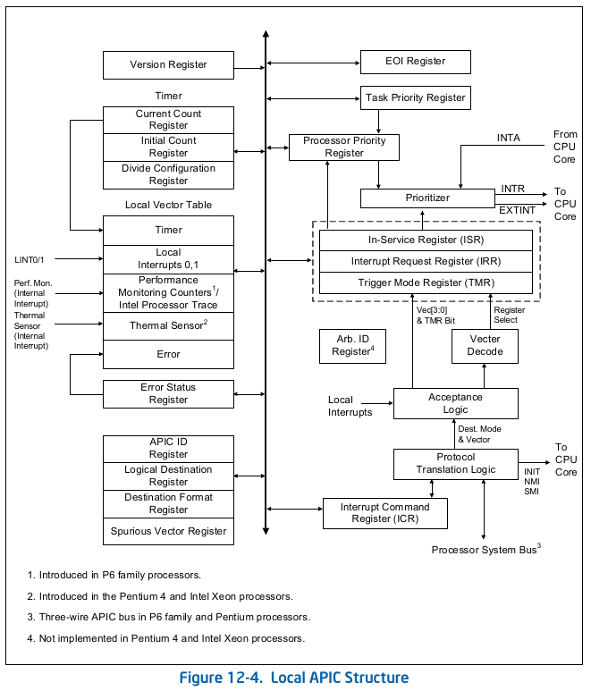
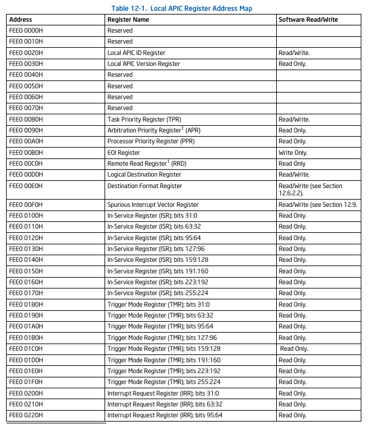

1. check cpu is support APIC
    ```
    从 P6 系列处理器开始，可以使用 CPUID 指令检测片上本地 APIC 的存在与否。当在 EAX 寄存器中使用源操作数 1 执行 CPUID 指令时，EDX 寄存器中返回的 CPUID 功能标志的第 9 位指示本地 APIC 的存在（置位）或不存在（清零）。
    ```
2. check cpu is support xAPIC or x2APIC
3. check is BSP?
        系统上电或复位后
        系统硬件会在系统总线上动态地把其中一颗处理器选为 BSP，其余处理器则被指定为 AP。
        BSP 的标识
        在 BSP 的 IA32_APIC_BASE MSR（见图 12-5）中，BSP 标志位被置 1，表示它是 BSP；其他处理器的该位均为 0。

        BSP 的职责:
            运行 BIOS 的启动代码；
            配置 APIC 环境；
            建立系统级数据结构；
            启动并初始化所有 AP。
        当 BSP 与全部 AP 完成初始化后，BSP 开始执行操作系统的初始化代码。
        每个逻辑处理器通过检查自身的 IA32_APIC_BASE MSR 中的 BSP 标志位 来决定：
            – 若为 BSP，则执行 BIOS 启动代码；
            – 若为 AP，则进入 等待 SIPI（Wait-for-SIPI） 状态。
        AP 的行为:
            上电或复位后，AP 仅完成最小化自配置；
            然后等待 BSP 发来的 SIPI（Startup IPI）消息；
            收到 SIPI 后，AP 执行 BIOS 的 AP 配置代码，最终进入 halt（暂停）状态。
            TIP:()


    ```TIP: 结束 BIOS 启动代码，开始执行操作系统启动与初始化代码。在此期间，AP 保持 halt 状态，!!!仅响应 INIT、NMI、SMI!!!，以及 探听（snoop）和 STPCLK# 引脚断言。       ---10.4.3 MP Initialization Protocol Algorithm for MP Systems```
4. check cpu core and logic processor
    ```
    软件可通过 CPUID 指令发现多核处理器中各“核心”与“逻辑处理器”的拓扑构成。每个物理核心内部可能包含一个或多个逻辑处理器。
    系统软件必须遵循 MP 初始化序列（见第 10.4 节 “多处理器（MP）初始化”）的要求，才能识别并启用这些逻辑处理器。在运行时，软件可枚举已被系统软件启用的逻辑处理器，进而确定它们之间的拓扑关系（见第 10.9.5 节 “在多处理器系统中识别拓扑关系”）。
    ```
5.local APIC Diagram

软件通过读写其寄存器与本地 APIC 交互。APIC 寄存器通过内存映射的方式映射到处理器物理地址空间的一个 4 KB 区域，初始起始地址为 FEE00000H。为了确保 APIC 正常工作，该地址空间必须映射到被指定为强不可缓存（UC）的内存区域。详见第 13.3 节 “可用的缓存方法”。
在 MP 系统配置中，系统总线上的 Intel 64 或 IA-32 处理器的 APIC 寄存器最初都映射到物理地址空间的同一 4 KB 区域。软件可以选择将所有本地 APIC 的初始映射更改到另一个 4 KB 区域，或者为每个本地 APIC 的 APIC 寄存器映射到各自独立的 4 KB 区域。第 12.4.5 节 “重新定位本地 APIC 寄存器” 描述了如何重新定位 APIC 寄存器的基地址。
在支持 x2APIC 架构的处理器上（通过 CPUID.01H:ECX[21] = 1 表示），本地 APIC 支持在 xAPIC 模式和（如果由软件启用）x2APIC 模式下运行。x2APIC 模式提供了扩展的处理器寻址能力（见第 12.12 节）。
```
对于 P6 家族、Pentium 4 和 Intel Xeon 处理器，APIC 会在内部处理对 4 KB APIC 寄存器空间内地址的所有内存访问，不会产生外部总线周期。对于带有片上 APIC 的 Pentium 处理器，访问 APIC 寄存器空间会产生总线周期。因此，对于打算在 Pentium 处理器上运行的软件，系统软件应明确地不将 APIC 寄存器空间映射到常规系统内存。否则，可能会导致生成无效操作码异常（#UD）或执行结果不可预测。
```




